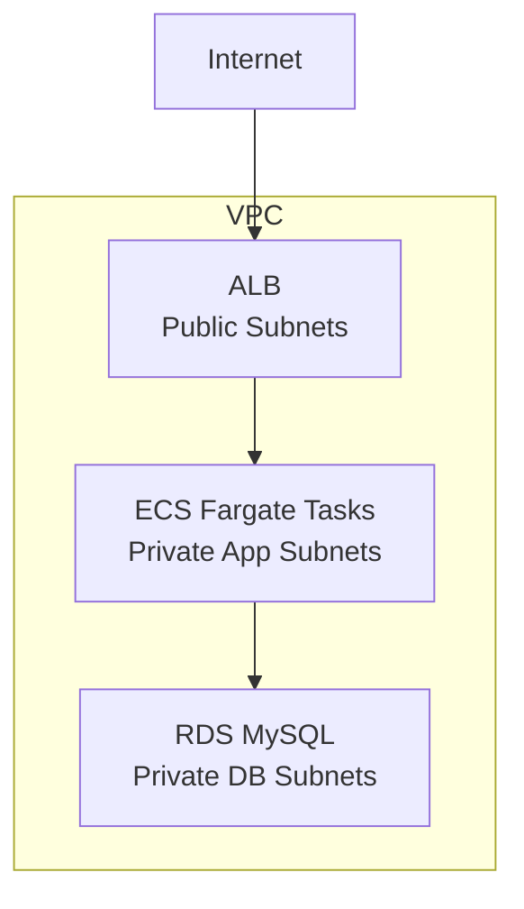

# 3-Tier Application Infrastructure with ECS

A AWS 3-tier web application infrastructure built with Terraform and automated with GitHub Actions CI/CD. Features containerized applications on ECS Fargate, high availability, and security best practices.

## Architecture Overview



### Tier 1: Web Layer (Load Balancer)
- **Application Load Balancer (ALB)** in public subnets
- Handles incoming HTTP traffic from the internet
- Distributes requests across ECS Fargate tasks
- Health checks ensure traffic only goes to healthy containers

### Tier 2: Application Layer (ECS Fargate)
- **ECS Fargate cluster** with containerized applications in private subnets
- Runs Nginx web server in Docker containers
- Serverless compute - no EC2 instances to manage
- Auto-scaling based on demand
- Container images stored in Amazon ECR
- Only accessible through the load balancer

### Tier 3: Database Layer (RDS)
- **MySQL RDS instance** in private database subnets
- Encrypted storage with automated backups (7-day retention)
- Only accessible from application containers
- Multi-AZ deployment for high availability

## Infrastructure Components

- **VPC**: Custom network (10.0.0.0/16) with public and private subnets across 2 AZs
- **Security Groups**: Firewall rules controlling traffic between tiers
- **VPC Endpoints**: Private connectivity to AWS services (ECR, S3, CloudWatch)
- **Internet Gateway**: Provides internet access to public subnets
- **ECR Repository**: Stores Docker container images
- **CloudWatch Logs**: Centralized logging for ECS tasks

## CI/CD Pipeline

### GitHub Actions Workflows

**1. Terraform CI/CD(not yet)** (`.github/workflows/terraform-ci.yml`)
- Triggers on push/PR to main branch
- OIDC authentication to AWS (keyless, secure)
- Validates Terraform code formatting
- Runs `terraform plan` and comments results on PRs
- No automatic deployment (safety first)

**2. ECS Deployment** (`.github/workflows/deploy.yml`)
- Triggers on push to main branch
- Builds Docker image from Dockerfile
- Pushes image to Amazon ECR
- Forces ECS service to deploy new version
- Zero-downtime rolling updates

## Deployment

### Prerequisites
1. **AWS Account** with appropriate permissions
2. **GitHub Repository** with secrets configured:
   - `AWS_ROLE_ARN` (for Terraform workflow with OIDC)
   - `AWS_ACCESS_KEY_ID` (for ECS deployment)
   - `AWS_SECRET_ACCESS_KEY` (for ECS deployment)
   - `DB_PASSWORD` (database master password)

### Initial Infrastructure Setup

1. **Initialize Terraform**:
   ```bash
   terraform init
   ```

2. **Plan deployment**:
   ```bash
   terraform plan -var="db_password=YourSecurePassword123"
   ```

3. **Deploy infrastructure**:
   ```bash
   terraform apply -var="db_password=YourSecurePassword123"
   ```

4. **Build and push initial Docker image**:
   ```bash
   aws ecr get-login-password --region us-east-1 | docker login --username AWS --password-stdin <account-id>.dkr.ecr.us-east-1.amazonaws.com
   docker build -t three-tier-app .
   docker tag three-tier-app:latest <account-id>.dkr.ecr.us-east-1.amazonaws.com/three-tier-app:latest
   docker push <account-id>.dkr.ecr.us-east-1.amazonaws.com/three-tier-app:latest
   ```

5. **Access application**:
   ```bash
   terraform output application_url
   ```

### Automated Deployment

After initial setup, every push to `main` branch automatically:
1. Validates Terraform changes (no auto-apply)
2. Builds new Docker image
3. Pushes to ECR
4. Deploys to ECS with zero downtime

## Security Features

- **Network Isolation**: Each tier in separate subnets with strict security groups
- **Private Subnets**: App and DB tiers not directly accessible from internet
- **VPC Endpoints**: Private connectivity to AWS services (no internet required)
- **OIDC Authentication**: GitHub Actions uses temporary credentials (no long-lived keys)
- **Encrypted Storage**: RDS encryption at rest
- **IAM Roles**: Least privilege access for ECS tasks
- **No Hardcoded Secrets**: Sensitive data passed via variables and GitHub secrets
- **Container Security**: Minimal Nginx Alpine base image

## Cost Optimization

- **ECS Fargate**: Pay only for container runtime (no idle EC2 instances)
- **Fargate Spot** (optional): Up to 70% savings for fault-tolerant workloads
- **db.t3.micro**: Cost-effective RDS instance for development
- **7-day log retention**: Balances observability with storage costs
- **VPC Endpoints**: Reduces data transfer costs and improves security

## Monitoring & Logging

- **CloudWatch Logs**: ECS task logs in `/ecs/three-tier-app` log group
- **ALB Access Logs**: Track incoming requests (optional)
- **ECS Service Metrics**: CPU, memory, task count
- **RDS Monitoring**: Database performance metrics

## Clean Up

To avoid ongoing charges:

1. **Empty ECR repository** (if force_delete is false):
   ```bash
   aws ecr batch-delete-image --repository-name three-tier-app --image-ids imageTag=latest
   ```

2. **Destroy infrastructure**:
   ```bash
   terraform destroy -var="db_password=YourSecurePassword123"
   ```

## File Structure

```
├── .github/
│   └── workflows/
│       ├── terraform-ci.yml    # Terraform validation pipeline
│       └── deploy.yml          # ECS deployment pipeline
├── app/
│   └── index.html             # Application content
├── modules/
│   ├── vpc/                   # VPC and networking
│   ├── vpc_endpoints/         # VPC endpoints for AWS services
│   ├── security_groups/       # Security group rules
│   ├── alb/                   # Application Load Balancer
│   ├── ecs/                   # ECS Fargate cluster and service
│   └── rds/                   # RDS MySQL database
├── Dockerfile                 # Container image definition
├── main.tf                    # Root module configuration
├── variables.tf               # Input variables
├── outputs.tf                 # Output values
├── providers.tf               # Provider configuration
└── README.md                  # This file
```

## Technology Stack

- **Infrastructure as Code**: Terraform
- **Container Orchestration**: Amazon ECS Fargate
- **Container Registry**: Amazon ECR
- **Load Balancing**: Application Load Balancer
- **Database**: Amazon RDS MySQL
- **CI/CD**: GitHub Actions
- **Authentication**: AWS OIDC for GitHub Actions
- **Logging**: Amazon CloudWatch Logs
- **Web Server**: Nginx (Alpine Linux)

## Next Steps

- Add auto-scaling policies for ECS service
- Implement blue/green deployments
- Add application monitoring with CloudWatch alarms
- Set up RDS read replicas for scaling
- Implement secrets management with AWS Secrets Manager
- Add WAF for enhanced security
- Configure custom domain with Route 53 and ACM
- Add 